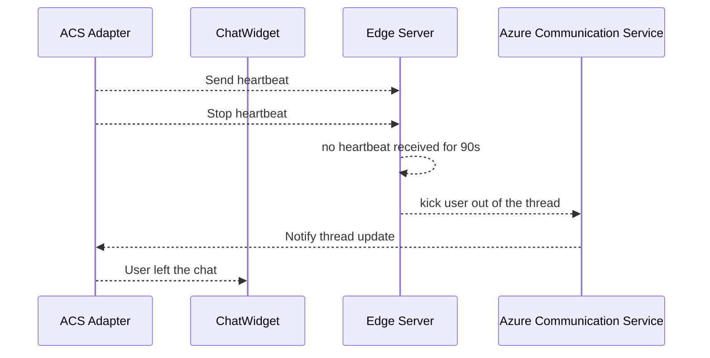

# Introduction

The Azure Communication Services WebChat Adapter is a project for connecting the Bot Framework WebChat Component to an Azure Communication Services Chat thread.
It provides a way to translate DirectLine activities to ACS Chat messages and vice versa, allowing for a seamless integration between the two services.

## Creating an adapter

``` js
createACSAdapter = (
  token: string,
  id: string,
  threadId: string,
  environmentUrl: string,
  fileManager: IFileManager,
  pollingInterval: number,
  eventSubscriber: IErrorEventSubscriber,
  displayName?: string,
  chatClient?: ChatClient,
  logger?: ILogger,
  adapterOptions?: AdapterOptions
): SealedAdapter<IDirectLineActivity, ACSAdapterState>
```

**`token`** An ACS user access token  
**`id`** The ACS user's id  
**`threadId`** Id of the chat thread to join  
**`environmentUrl`** ACS resource endpoint  
**`fileManager`** IFileManager instance for file sharing  
**`pollingInterval`** Interval in milliseconds that the  adapter will poll for messages, polling is only done when notifications are not enabled. The minimum value is 5 seconds. Default value is 30 seconds.
**`eventSubscriber`** IErrorEventSubscriber instance to send error events to the caller.
**`displayName`** User's displayname  
**`chatClient`** Chat Client  
**`logger`** Logger instance  
**`adapterOptions`** Adapter options, see [Feature Options](#feature-options) for more detail  

## Example Application

This project includes a sample application that demonstrates how to use the Azure Communication Services WebChat Adapter. The sample application is a simple web app that allows two users to chat with each other using the adapter.

### Before You Start

The Azure Communication Services WebChat Adapter requires a `ResourceConnectionString` and optionally a `OneDriveToken` to use file sharing.
Ensure that the test application has access via environment variables to the following:

* `ResourceConnectionString`: The connection string for the Azure Communication Service resource.
* `OneDriveToken`: The OneDrive token for file sharing, if you want to use file sharing.

## Getting Started

1. Ensure you have Node.js LTS installed on your machine. You can download them from [Node.js official website](https://nodejs.org/).
2. `npm install`
3. `npm run start`
4. Open <http://localhost:8080> in your browser
5. Copy & paste the address bar content to another tab to enable another chat client
6. The two clients can now chat to each other

## Project structure

``` txt
src
├── egress
│   └── createEgress[ActivityType]ActivityMiddleware.ts
├── ingress
│   └── subscribe[Event].ts
└── sdk
index.html
```

`ingress` contains the event subscribe middleware which listens to incoming events, translates them to DirectLine Activities and dispatches those to Webchat

`egress` contains the middleware which translates DirectLine activities to Azure Communication Services Chat calls, made to the backend service.

`sdk` contains API wrappers for  zincluding authentication

`index.[*].html` is the entry to a sample application, run by `npm run start`.

## How it works

Install VSCode mermaid extension to view this diagram in VSCode
There are 2 token types:

1. User Token is what the web app uses to validate a login user
2. ACS Token is what ACS Adapter use to communicate with Azure Communication Service

## Handshake process


Notes:

1. All authentications depend on the original app authentication, and the application server is responsible for assigning a token after user validation (and binding the token with user info)
2. Every time the token service is asked to create a new user token, a new communications services user is created and token binding happens again

3. Thread creation could happen either in the backend service or in the adapter; it is a preference of the developer

## Message sending and receiving


## Details for waiting queue


## Details for idle status



## Build and Test

## Build a dev test JavaScript file

For developer testing, a JavaScript file can work without server logic - check `Before You Start` above for more details.

1. Run `npm run build:dev`
2. Use `webchat-adapter-dev.js` from the `dist` directory
3. Add `webchat-adapter-dev.js` as `<script>` tag in HTML, and call `window.ChatAdapter.initializeThread()`
4. Call `window.ChatAdapter.createACSAdapter` (details in `index.html`)

## Build a consumable JavaScript file

1. Run `npm run build`
2. Get `webchat-adapter.js` from the `dist` directory
3. Get all the parameters for `createACSAdapter` from the server side
4. Add `webchat-adapter.js` through a `<script>` tag in HTML, and call `window.ChatAdapter.createACSAdapter` (details in `index.html`)

## Telemetry

To use telemetry for adapter, you will need to implement the logger API for the adapter.

``` TypeScript
interface ILogger {
  logEvent(loglevel: LogLevel, event: ACSLogData): void;
}
```

## Error event notifier

The adapter can notify the caller of any errors that occur during the operation of the adapter. This is done through an `IErrorEventSubscriber` interface which allows the caller to receive error events.

To use the error event notifier, you will need to implement the following method

``` TypeScript
interface IErrorEventSubscriber {
  notifyErrorEvent(adapterErrorEvent: AdapterErrorEvent): void;
}
```

Pass it in through the call to `window.ChatAdapter.createACSAdapter`. See `index.html` for reference.

## Feature Options

The following features can be configured through the  `AdapterOptions` interface.

``` TypeScript
export interface AdapterOptions {
  enableAdaptiveCards: boolean; // to enable adaptive card payload in adapter (which will convert content payload into a json string)
  enableThreadMemberUpdateNotification: boolean; // to enable chat thread member join/leave notification
  enableLeaveThreadOnWindowClosed: boolean; // to remove user on browser close event
  enableSenderDisplayNameInTypingNotification?: boolean; // Whether to send sender display name in typing notification,
  historyPageSizeLimit?: number; // If requested paged responses of messages otherwise undefined
  serverPageSizeLimit?: number; // Number of messages to fetch from the server at once
  shouldFileAttachmentDownloadTimeout?: boolean; // Whether file attachment download be timed out.
  fileAttachmentDownloadTimeout?: number; // If shouldFileAttachmentDownloadTimeout is set then timeout value in milliseconds when attachment download should be timed out. Default value 90s.
  messagePollingHandle?: IMessagePollingHandle; // Provides more control over polling calls made to Chat Gateway service.
}

```

Adapter options are passed-through to DirectLine while creating the adapter.

``` TypeScript
        const featuresOption = {
          enableAdaptiveCards: true,
          enableThreadMemberUpdateNotification: true,
          enableLeaveThreadOnWindowClosed: true,
          enableSenderDisplayNameInTypingNotification: true,
          historyPageSizeLimit: 5,
          serverPageSizeLimit: 60,
          shouldFileAttachmentDownloadTimeout: true,
          fileAttachmentDownloadTimeout: 120000
        };

        const directLine = createACSAdapter(
                              token, userId, threadId, environmentUrl, 
                              fileManager, displayName, logger, featuresOption
                           );
```

Option | Type | Default | Description |
--- | --- | --- | --- |
enableThreadMemberUpdateNotification | boolean | false | Send chat thread member update notification activities to WebChat when a new user joins thread or a user leave the thread. |
enableAdaptiveCards | boolean | false | The Adaptive Cards are sent as attachments in activity. The format is followed as per [guidelines](https://docs.microsoft.com/en-us/adaptive-cards/getting-started/bots). Development Panel has adaptive card implementation.The example code can be found at location src/development/react-components/.adaptiveCard.tsx |
enableLeaveThreadOnWindowClosed | boolean | false | On browser close, whether users will remove themselves from the chat thread. |
enableSenderDisplayNameInTypingNotification | boolean | false | Whether send user display name when sending typing indicator. |
historyPageSizeLimit | number | undefined | History message pagination can be turned on via setting a valid historyPageSizeLimit. To send a pagination event: window.dispatchEvent(new Event('acs-adapter-loadnextpage'));|
serverPageSizeLimit | number | undefined | Number of messages to fetch from the server at once. Putting a high value like 60 will result in a fewer calls to the server to fetch all the messages on a thread. |
shouldFileAttachmentDownloadTimeout | boolean | undefined | Whether file attachment download be timed out. |
fileAttachmentDownloadTimeout | number | undefined | If the `shouldFileAttachmentDownloadTimeout` is set then the value of timeout when file download should be timed out. Default will be 90000ms enforced only when `shouldFileAttachmentDownloadTimeout` is true, otherwise will wait for browser timeout. |
messagePollingHandle | Interface IMessagePollingHandle | undefined | Provides methods to control polling. |

### IMessagePollingHandle Interface

`IMessagePollingHandle` has been added to provide more control over polling calls that Adapter invokes to fetch messages in the background. In some cases clients might want to stop these calls from their end either completely or temporarily when a user is removed as a participant. Interface provides two methods whose description is below that client could implement and provide a reference to in `AdapterOptions`.

Method | Description | Return value | Default |
--- | --- | --- | --- |
`getIsPollingEnabled: () => boolean;` | Get client polling setting during each polling cycle. This only disables the call to the service but the scheduler is still on going | Return `true` to execute message fetching call for current cycle. Return `false` to skip message fetching call for current cycle. | `true` |
`stopPolling: () => boolean;` | This stops the scheduler from scheduling any further message fetching calls. | Return   `true` to stop scheduling any next message fetching calls. Return `false` to continue scheduling next message fetching calls | `false` |

## Leave Chat Event

A user can leave the chat thread using the adapter. To leave chat raise a `acs-adapter-leavechat` event. The sample code can be found in `src\development\react-components\leaveChatButton.tsx`.
The development panel contains this button.

``` TypeScript
window.dispatchEvent(new Event('acs-adapter-leavechat'));
```

## Egress Error

When the `egress` throws an exception, an activity with channel data of type `error` will be triggered.

To display message to user, you can detect activity of type error like below. The message and stack of the `Error` object is saved in the activity text property.

``` TypeScript
   if (
      action.payload &&
      action.payload.activity?.channelData &&
      action.payload.activity?.channelData.type == 'Error'
      ) {
          dispatch({
          type: 'WEB_CHAT/SET_NOTIFICATION',
            payload: {
            level: 'info',
            message: message: JSON.parse(action.payload.activity.text).payload.details.Message
          }
    });
```

## Development Panel

A development Panel is integrated inside of the dev mode JavaScript bundle file. If you want to use the development panel, you need to include the `webchat-adapter-dev.js` file in your HTML file.

``` TypeScript
  const {
    renderDebugPanel
  } = window.ChatAdapter;

/*
Create adapter and store...
*/

 window.WebChat.renderWebChat(
    {
      directLine,
      store,
    },
    document.getElementById('root')
  );

  renderDebugPanel(document.getElementById('devPanel'), store);
```

The development panel has a UI for adaptive cards, along with the 'leave chat' button implementation.

To launch the development panel in dev mode:

1. Run `npm run start`
2. Browse <http://localhost:8080/index.html>
3. To show/hide (toggle) development panel, press Ctrl+d

## Unit Tests

All the unit test files are under /test/unit folder, run `npm run test:unit` to test
To run a single test file for instance, run `npm run test:unit -- test/unit/ingress/subscribeNewMessageAndThreadUpdate.test.ts`

When you are writing test and wanna debug it:

1. Run `npm run test:debug` to test
2. Switch to VSCode debug tab and choose attach
3. VSCode debug tool should be able to connect to debug thread, set breakpoints and have fun!

## Integration Tests

All the integration test files are under /test/integration folder. Ensure you have set the environment variables `ResourceConnectionString` and (optionally) `OneDriveToken` before running the tests.

To test:

1. Run `npm run install:chromedriver` to install chrome driver
2. Run `npm run execute:integrationtest` to test

## File Sharing

To enable file sharing, implement the IFileManager interface and provide an instance of this when creating the adapter. See `index.html` for an example using the OneDriveFileManager implementation.

`activity.attachments` Contains the attachment data. Each attachment contains the following properties:

`contentType` The MIME-type  
`contentUrl` The file contents URL  
`name` The filename  
`thumbnailUrl` Applicable to images and videos only, the image thumbnail URL  

When sending attachments ensure the `attachments` property is populated on the Message activity that is sent to the adapter, this is done by WebChat component.

When receiving messages the adapter will populate this property if the ChatMessage contains attachments.

As file sharing is supported through metadata, the `activity.channelData.metadata` will contain the property returned by IFileManager's `createChatMessageMetadata()`method. You do NOT need to explicitly set this in the metadata yourself.

Example of an activity with attachments that WebChat component sends to adapter:

``` TypeScript
const activity: ACSDirectLineActivity = {
  ...
  attachments: [
    {
      filename: "<YOUR_FILENAME>",
      contentType: "<YOUR_FILETYPE>"
      contentURL: "<YOUR_URL>"
      thumbnailURL: "<YOUR_THUMBNAIL_URL>"
    }
  ]
  ...
}
```

Note that when using WebChat components built-in file attachment capabilities, you should not need to construct this activity yourself.

`attachments` are passed directly to `IFileManager` uploadFiles() method, if you require additional data for file upload you can modify the attachments in the activity.

For example in the attachments below, `myAdditionalData` will be passed inside attachments to uploadFile():

``` TypeScript
attachments: {
  filename: "<YOUR_FILENAME>",
  contentType: "<YOUR_FILETYPE>"
  contentURL: "<YOUR_URL>"
  thumbnailURL: "<YOUR_THUMBNAIL_URL>"
  myAdditionalData: "<YOUR_ADDITIONAL_DATA>"
}
```

## Tags

The adapter supports message tagging, which are sent as ChatMessage metadata.

`activity.channelData.tags: string`
To send tags to the adapter, populate this property inside the activity. When receiving activities from the adapter, this property will be populated if the ChatMessage contains tags.

Note since tags are sent as metadata `activity.channelData.metadata.tags` will also contain the tags. You do NOT need to explicitly set this in the metadata yourself.

An example of sending tags in an activity:

```TypeScript
const activity: ACSDirectLineActivity = {
  ...
  channelData: {
    tags: "tag1"
  }
  ...
}
```

And the resulting metadata on the ChatMessage object:

``` TypeScript
const message: ChatMessage = {
  ...
  metadata: {
    tags: "tag1"
  }
  ...
}
```

## Metadata

ChatMessages may contain metadata, which is a property bag of string key-value pairs.

Message tagging and file sharing are supported through ChatMessage metadata, you do NOT need to explicitly set these in the metadata yourself, the adapter will do that for you. You can however send additional metadata if needed.

You can send additional ChatMessage metadata by populating the `activity.channelData.metadata` property which is of type `Record<string, string>`. When receiving ChatMessages, the adapter will populate this property if the message contains metadata.

An Example Activity showing metadata format:

```TypeScript

const activity: ACSDirectLineActivity = {
  ...
  channelData: {
    metadata: {
      "<YOUR_KEY>" : "<YOUR_VALUE>"
    }
  }
  ...
}
```

## Message Edits

**Note:** The WebChat component does not support message edits.
**Note:** If adaptive cards are enabled, the adapter expects the message content to be a JSON object with text property.
For example, valid content for an adaptive card:

``` TypeScript
JSON.stringify({
  text: "Hello world!"
})
```

The adapter listens for ChatMessageEditedEvents and will dispatch an MessageEdit activity when incoming events are received.

**Since message edits are unsupported by WebChat, MessageEdit Activities are custom activity types that you must handle yourself**.

MessageEdit activities contain the edited content (which may be the message content or metadata) as well as the timestamp when the message was edited. The MessageEdit Activity will have the same messageid as the original ChatMessage.

Below shows the format of a MessageEdit Activity, see the ACSDirectLineActivity for more type information:

``` TypeScript
    const activity: IDirectLineActivity = {
      attachment?s: any[],
      channelId: string,
      channelData?: {
        attachmentSizes: number[],
        tags: string,
        metadata: Record<string, string>;
      },
      conversation: { id: string },
      from: {
        id: string,
        name: string,
        role: string
      },
      messageid: string,
      text: string,
      timestamp: string,
      type: ActivityType.Message
    }
```

The following properties contain information about the message edit:

**`text`** is the edited message's content  
**`timestamp`** is the timestamp when the message was edited, in ISO 8601 format  
**`messageid`** is the id of the edited message  
**`type`** is ActivityType.Message which is equal to "message"  

If the edited message contains metadata the following properties will be present:
**`attachments`** is an array of objects containing file attachment data, see [FileSharing](#File Sharing) for more detail.  
**`channelData.tags`** contains the message tags (this is an optional metadata property)  
**`channelData.metadata`** contains the message metadata  

## Adaptive Cards

Enable Adaptive Cards by setting `enableAdaptiveCards` inside `AdapterOptions` to `true`. When enabled, the adapter will determine if the received message is an adaptive card & format the activity appropriately. If adaptive cards are not enabled then WebChat will render messages as is.

ACS Adapter expects the ChatMessage for an adaptive card to contain:

1. The adaptive card JSON as the message content
2. The ChatMessage metadata to contain the key `microsoft.azure.communication.chat.bot.contenttype` with a value of `azurebotservice.adaptivecard`

## Custom Middleware

**NOTE** WebChat currently supports activity middleware and createStore middleware, these can also be utilized for similar effect.

You can provide your own custom egress and ingress middleware when initializing the adapter.  
Inside `AdapterOptions`, provide `ingressMiddleware` and/or `egressMiddleware`.  

`ingressMiddleware`: An array of middleware that are invoked on incoming messages from ACS. The middleware will be applied in the order they are provided. Ingress middleware can be used to intercept messages received from ACS.  

`egressMiddleware`: An array of middleware that are invoked on outgoing messages to ACS. The middleware will be applied in the order they are provided. Egress middleware can be used to intercept messages before sending them to ACS.

For example, you can create a middleware that logs all incoming messages or modifies outgoing messages before they are sent:

``` TypeScript
const myEgressMiddleware = ({ getState }) => (next) => (activity) => {
  if (activity.type === ActivityType.Message) {
    // Do something with the message before sending it to Communication Services
  }
  return next(activity);
}

const options: AdapterOptions  = {
  enableAdaptiveCards: false,
  enableThreadMemberUpdateNotification: true,
  enableLeaveThreadOnWindowClosed: true,
  historyPageSizeLimit: 5,
  egressMiddleware: [myEgressMiddleware]
};

const adapter = createACSAdapter(
  token,
  userId,
  threadId,
  environmentUrl,
  fileManager,
  pollingInterval,
  displayName,
  logger,
  options
);
```

## Contributing

We welcome contributions to the Azure Communication Services WebChat Adapter project. If you have suggestions, bug reports, or feature requests, please open an issue or pull request.

## Trademarks

This project may contain trademarks or logos for projects, products, or services. Authorized use of Microsoft
trademarks or logos is subject to and must follow [Microsoft's Trademark & Brand Guidelines](https://www.microsoft.com/en-us/legal/intellectualproperty/trademarks/usage/general).
Use of Microsoft trademarks or logos in modified versions of this project must not cause confusion or imply Microsoft sponsorship.
Any use of third-party trademarks or logos are subject to those third-party's policies.
